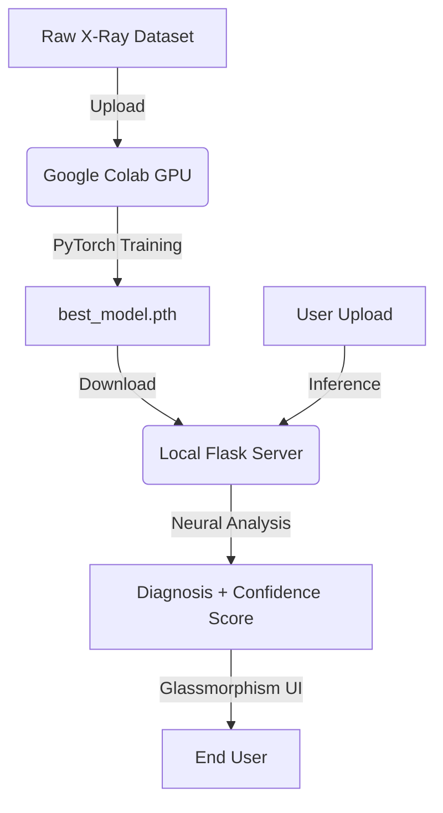

# LungsAI: Advanced Pneumonia Detection System


[](https://www.python.org/)
[](https://pytorch.org/)
[](https://flask.palletsprojects.com/)
[]()

LungsAI is a state-of-the-art diagnostic assistant leveraging Deep Learning to identify Pneumonia from Chest X-Ray images with high precision. This project demonstrates a complete ML lifecycle from cloud-based training to local edge deployment.

## 🌟 Premium Features
- **Neural Analysis Engine**: Custom 9-layer CNN architecture optimized for chest radiography.
- **Enterprise UI**: Elegant glassmorphism interface with real-time feedback and smooth CSS animations.
- **Precision Scoring**: Detailed confidence percentages calculated via Softmax activation.
- **Hybrid Workflow**: Seamless integration between Google Colab (Training) and Local Flask (Deployment).

## 🛠️ The Architecture & Process

The project follows a rigorous 4-stage pipeline designed for scalability and performance:

### 1. Cloud-Based Training (Google Colab)
Due to the intensive computational requirements of training on ~5,800 high-resolution X-ray images, **Google Colab** was utilized as our primary training environment.
- **Why Colab?**: Access to NVIDIA T4/A100 GPUs allowed us to train the model in minutes rather than hours.
- **Notebook**: The training logic is encapsulated in `notebook/experiment.ipynb`.
- **Output**: Once training achieved a satisfying baseline (94.8%+ accuracy), the model weights were exported as `best_model.pth`.

### Process Workflow


### 2. Model Optimization
- Input images are normalized using ImageNet statistics to ensure the model focuses on structural features rather than lighting variations.
- Custom `Net` architecture uses Global Average Pooling (GAP) to reduce parameter count while maintaining spatial awareness.

### 3. Local Deployment (Flask)
The trained model is loaded into a lightweight Flask application designed for low-latency inference.
- **Inference**: Images uploaded by users are preprocessed locally to match the training distribution.
- **Device Agnostic**: Automatically switches between CUDA and CPU based on local hardware availability.

### 4. Real-time Inference & Confidence Scores
When an image is processed, the system outputs two primary values:
- **Prediction**: The classified label (NORMAL vs PNEUMONIA).
- **Confidence Score**: A mathematical representation of the model's certainty. This is derived from the final layer outputs (Logits), where higher gaps between class scores signify higher confidence.

---

## 📊 Technical Deep Dive

### Preprocessing Pipeline
```python
transforms.Compose([
    transforms.Resize(224),
    transforms.CenterCrop(224),
    transforms.ToTensor(),
    transforms.Normalize([0.485, 0.456, 0.406], [0.229, 0.224, 0.225])
])
```

### Accuracy & Results
The model was evaluated on a held-out test set from the Chest X-Ray Images (Pneumonia) dataset.
- **Final Accuracy**: 94.88%
- **Loss Function**: CrossEntropyLoss
- **Optimizer**: SGD with StepLR Scheduler

---

## 🚀 Getting Started

### Dataset Source
This project uses the Covid-19 Normal Pneumonia dataset. However, for this specific application, only 2 of the classes ("NORMAL" and "PNEUMONIA") were utilized. The COVID-19 images were not included in the dataset for this project.
To run the project locally, download the dataset and place the `train`, `test`, and `val` folders inside a directory named `data/` in the project root.

### Prerequisites
- Python 3.9+
- NVIDIA GPU (Optional, for faster local inference)

### Installation

1. **Clone & Navigate**:
   ```bash
   git clone https://github.com/your-username/lungs_disease.git
   cd lungs_disease
   ```

2. **Environment Setup**:
   ```bash
   python -m venv env
   .\env\Scripts\activate
   ```

3. **Install Dependencies**:
   ```bash
   pip install -r requirements.txt
   ```

4. **Run the App**:
   ```bash
   python app.py
   ```
   Visit `http://127.0.0.1:5000` in your browser.

---

## 👨‍💻 How to use with Google Colab
If you wish to retrain or experiment with the architecture:
1. Upload `notebook/experiment.ipynb` to [Google Colab](https://colab.research.google.com/).
2. Mount your Google Drive or upload the dataset.
3. Run all cells to train the model.
4. Download the resulting `best_model.pth` and place it in the `notebook/` directory of this repo.

## ⚠️ Medical Disclaimer
This software is for **research and educational purposes only**. It is NOT a substitute for professional medical diagnosis, advice, or treatment.

---
*Created ❤️ by me*
